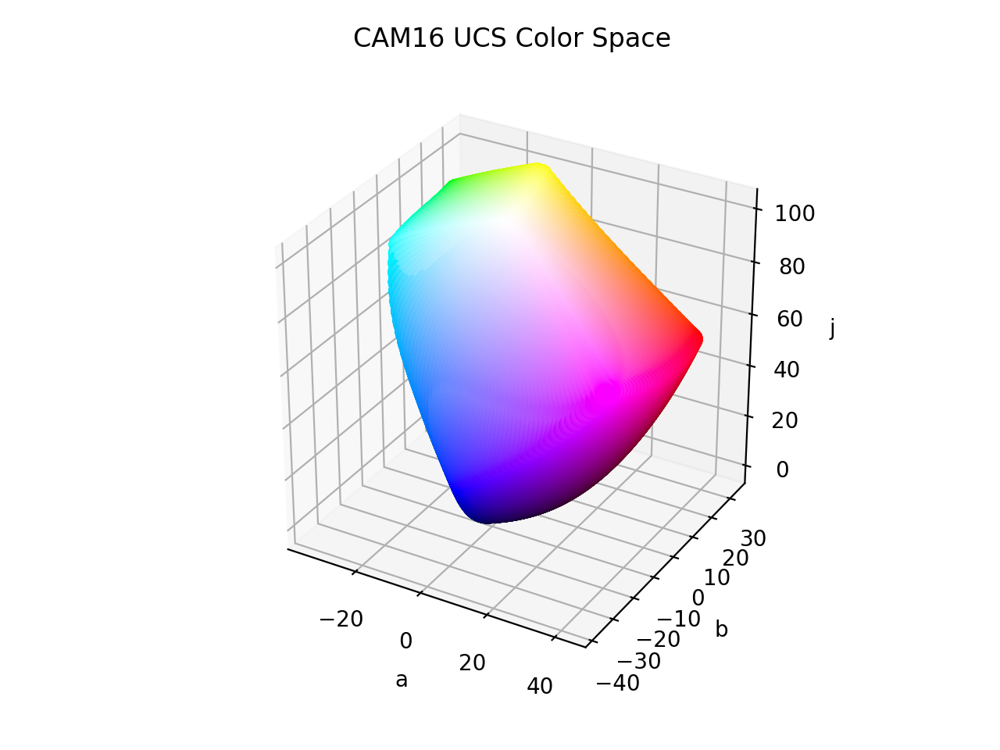

# CAM16 UCS

<div class="info-container" markdown="1">
!!! info inline end "Properties"

    **Name:** `cam16-ucs`

    **White Point:** D65

    **Coordinates:**

    Name | Range
    ---- | -----
    `j`  | [0, 100]
    `a`  | [-100, 100]
    `b`  | [-100, 100]

<figure markdown>



<figcaption markdown>
The sRGB gamut represented within the CAM16 UCS color space.
</figcaption>
</figure>

A color appearance model (CAM) is a mathematical model that seeks to describe the perceptual aspects of human color
vision, i.e. viewing conditions under which the appearance of a color does not tally with the corresponding physical
measurement of the stimulus source.

The CAM16 is a successor of CIECAM02 with various fixes and improvements. It also comes with a color space called
CAM16-UCS. It is published by a CIE workgroup, but is not yet a CIE standard.

Because CIECAM16 UCS is a perceptually uniform color space, color distancing can use Euclidean distancing as a base. For
the sake of color difference, two other spaces called CAM16 LCD and CAM16 SCD are also included for large scale and
small scale color differencing. They are available as `cam16-lcd` and `cam16-scd`.

[Learn more](https://en.wikipedia.org/wiki/Color_appearance_model).
</div>

## Channel Aliases

Channels | Aliases
-------- | -------
`j`      | `lightness`
`a`      |
`b`      |

## Input/Output

The CAM16 UCS space is not currently supported in the CSS spec, the parsed input and string output formats use
the `#!css-color color()` function format using the custom name `#!css-color --cam16-ucs`:

```css-color
color(--cam16-ucs j a b / a)  // Color function
```

The string representation of the color object and the default string output use the
`#!css-color color(--cam16-ucs u v w / a)` form.

```playground
Color("cam16-ucs", [59.178, 40.82, 21.153], 1)
Color("cam16-ucs", [78.364, 9.6945, 28.629], 1).to_string()
```

## Registering

```py
from coloraide import Color as Base
from coloraide_extras.spaces.cam16_ucs import CAM16UCS

class Color(Base): ...

Color.register(CAM16UCS())
```

<style>
.info-container {display: inline-block;}
</style>
