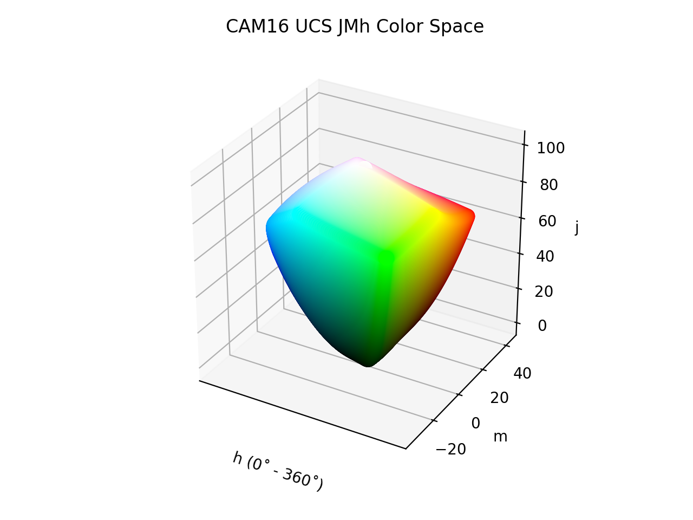

# CAM16 UCS JMh

<div class="info-container" markdown="1">
!!! info inline end "Properties"

    **Name:** `cam16-ucs-jmh`

    **White Point:** D65

    **Coordinates:**

    Name | Range
    ---- | -----
    `j`  | [0, 100]
    `m`  | [-100, 100]
    `h`  | [-100, 100]

<figure markdown>



<figcaption markdown>
The sRGB gamut represented within the CAM16 UCS JMh color space.
</figcaption>
</figure>

CAM16 UCS JMh is the defined polar form the [CAM16 UCS](./cam16_ucs.md) color space. It shares the same lightness (J),
but instead of the lab-like components `a` and `b`, it uses colorfulness (M) and hue (h).

[Learn more](https://doi.org/10.1002/col.22131).
</div>

## Channel Aliases

Channels | Aliases
-------- | -------
`j`      | `lightness`
`m`      | `colorfulness`
`h`      | `hue`

## Input/Output

The CAM16 UCS JMh space is not currently supported in the CSS spec, the parsed input and string output formats use the
`#!css-color color()` function format using the custom name `#!css-color --cam16-ucs-jmh`:

```css-color
color(--cam16-ucs-jmh j m h / a)  // Color function
```

The string representation of the color object and the default string output use the
`#!css-color color(--cam16-ucs-jmh j m h / a)` form.

```playground
Color("cam16-ucs-jmh", [59.178, 45.975, 27.393], 1)
Color("cam16-ucs-jmh", [78.364, 30.226, 71.293], 1).to_string()
```

## Registering

```py
from coloraide import Color as Base
from coloraide_extras.spaces.cam16_ucs_jmh import CAM16UCSJMh

class Color(Base): ...

Color.register(CAM16UCSJMh())
```

<style>
.info-container {display: inline-block;}
</style>
