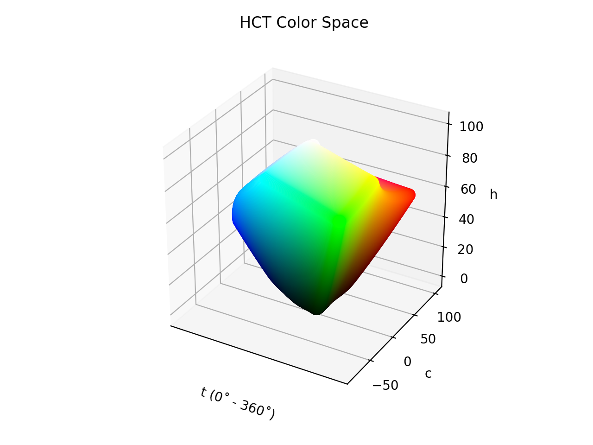

# HCT

<div class="info-container" markdown="1">
!!! info inline end "Properties"

    **Name:** `hct`

    **White Point:** D65

    **Coordinates:**

    Name | Range^\*^
    ---- | -----
    `h`  | [0, 360]
    `c`  | [0, 145]
    `t`  | [0, 100]

    ^\*^ Space is necessarily bound to the range and is only used as a reference to define percentage inputs/outputs in
    relation to the Display P3 color space. Lightness is bound to the SDR range.

<figure markdown>



<figcaption markdown>
The sRGB gamut represented within the HCT color space.
</figcaption>
</figure>

The HCT color space is Google's attempt at a perceptually accurate color system. Essentially, it is two color spaces
glued together. 'H' (hue) and 'C' (chroma) come from the CAM16 color appearance model and 'T' (tone) is the lightness
from the CIELAB (D65) color space. The idea was to take the more consistent perceptual hues from CAM16 and use the
better lightness prediction found in CIELAB, so a new space was created by literally sticking the components together.

In general, CAM16 is not a cheap color space to calculate, and all the glue to hold the components together makes it a
bit more expensive, but considering the use case that it was designed for, creating better color schemes with decent
contrast, it has attractive benefits.

!!! note "Implementation Notes"

    Conversions in our library may be slightly different in some cases compared to the Material Color Utilities, where
    Google has implemented the HCT color space. This is because we have implemented the library as _described_, we did
    not port their implementation.

    Material uses RGB matrices and white point vectors that utilize less precision than we do. That doesn't make their
    implementation worse or better, but their results will be slightly different at times because of these differences.
    Additionally, the Material library uses more coarse steps in things like chroma when converting back to XYZ which
    most likely allows for faster conversions, but not as much fine resolution for great round tripping of values.

    The differences, at most, will cause a channel to differ by a value of +/-1 in a range of 0 - 255. Overall, this
    isn't visually noticeable, and makes perfect sense due to the variation of precision used for the conversion
    matrices.


[Learn more](https://material.io/blog/science-of-color-design).
</div>

## Channel Aliases

Channels | Aliases
-------- | -------
`h`      | `hue`
`c`      | `chroma`
`t`      | `tone`, `lightness`

## Input/Output

The HCT space is not currently supported in the CSS spec, the parsed input and string output formats use
the `#!css-color color()` function format using the custom name `#!css-color --hct`:

```css-color
color(--hct h c t / a)  // Color function
```

The string representation of the color object and the default string output use the
`#!css-color color(--hct h c t / a)` form.

```playground
Color("hct", [27.41, 113.36, 53.237], 1)
Color("hct", [71.257, 60.528, 74.934], 1).to_string()
```

## Registering

```py
from coloraide import Color as Base
from coloraide_extras.spaces.hct import HCT

class Color(Base): ...

Color.register(HCT())
```

<style>
.info-container {display: inline-block;}
</style>
