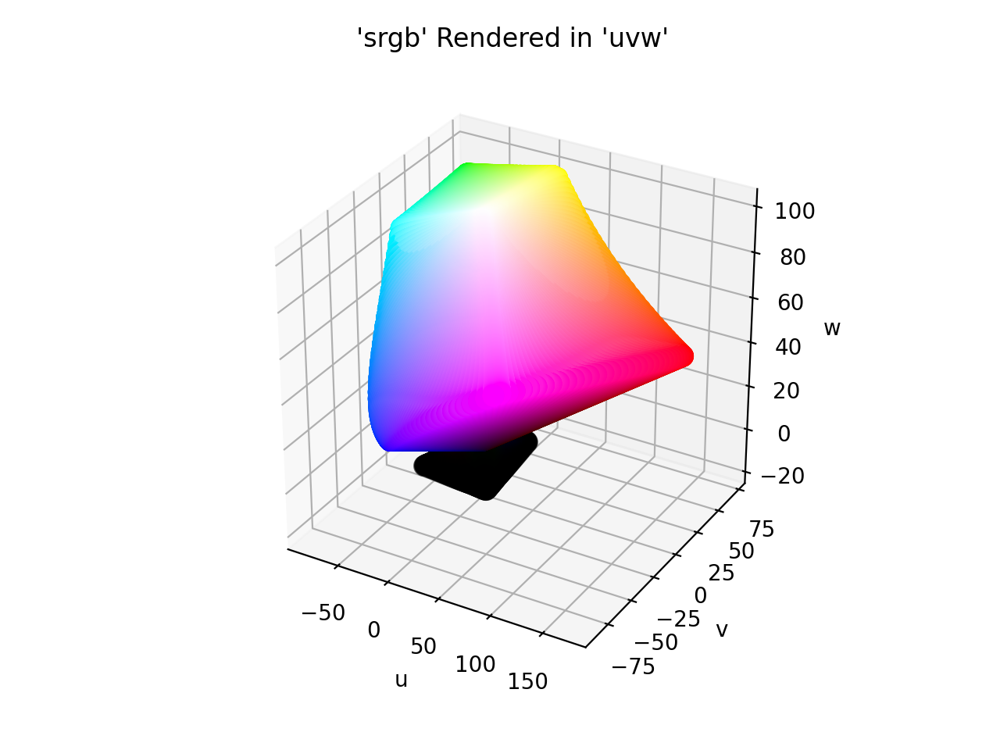

# Supported Color Spaces

ColorAide Extras adds a number of additional color spaces to ColorAide. Some are just spaces that are less practical
to use for common cases, some are just interesting for specific applications, some are implemented just for history,
and some are fairly new and a bit experimental.

## CIE 1960 UCS

<div class="info-container" markdown="1">
!!! info inline end "Properties"

    **Name:** `ucs`

    **White Point:** D65

    **Coordinates:**

    Name | Range
    ---- | -----
    `u`  | [0.0, 0.634]^\*^
    `v`  | [0.0, 1.0]^\*^
    `w`  | [0.0, 1.569]^\*^

    ^\*^ ≈ range in relation to sRGB rounded to 3 decimal places.

<figure markdown="1">


<figcaption>The sRGB gamut represented within the CIE 1960 UCS color space.</figcaption>
</figure>

The CIE 1960 color space ("CIE 1960 UCS", variously expanded Uniform Color Space, Uniform Color Scale, Uniform
Chromaticity Scale, Uniform Chromaticity Space) is another name for the (u, v) chromaticity space devised by David
MacAdam. The color space is implemented using the relation between this space and the XYZ space as coordinates U, V, and
W.

[Learn more](https://en.wikipedia.org/wiki/CIE_1960_color_space).
</div>

??? abstract "ColorAide Details"

    **Channel Aliases:**
    : 
        Channels | Aliases
        -------- | -------
        `u`      |
        `v`      |
        `w`      |

    **Inputs**
    : 

        The UCS space is not currently supported in the CSS spec, the parsed input and string output formats use the
        `#!css-color color()` function format using the custom name `#!css-color --ucs`:

        ```css-color
        color(--ucs u v w / a)  // Color function
        ```

    **Output:**
    : 
        The string representation of the color object and the default string output use the
        `#!css-color color(--ucs u v w / a)` form.

        ```playground
        Color("ucs", [0, 0, 0], 1)
        Color("ucs", [0, 0, 0], 1).to_string()
        ```

## CIE 1964 UVW

<div class="info-container" markdown="1">
!!! info inline end "Properties"

    **Name:** `uvw`

    **White Point:** D65

    **Coordinates:**

    Name | Range
    ---- | -----
    `u`  | [-82.154, 171.8]^\*^
    `v`  | [-87.173, 70.825]^\*^
    `w`  | [-17.0, 99.04]^\*^

    ^\*^ ≈ range in relation to sRGB rounded to 3 decimal places.

<figure markdown="1">



<figcaption>The sRGB gamut represented within the UVW color space.</figcaption>
</figure>

!!! note
    It is a bit uncertain as to why the 3D model shows a number of values resolving to a black bulb under the shape,
    but the translation as been compared against some other libraries that have implemented the space, and it seems to
    align :shrug:.

Wyszecki invented the UVW color space in order to be able to calculate color differences without having to hold the
luminance constant. He defined a lightness index W* by simplifying expressions suggested earlier by Ladd and Pinney,
and Glasser et al.. The chromaticity components U* and V* are defined such that the white point maps to the origin,
as in Adams chromatic valence color spaces.

[Learn more](https://en.wikipedia.org/wiki/CIE_1964_color_space).
</div>

??? abstract "ColorAide Details"

    **Channel Aliases:**
    : 
        Channels | Aliases
        -------- | -------
        `u`      |
        `v`      |
        `w`      |

    **Inputs**
    : 

        The UVW space is not currently supported in the CSS spec, the parsed input and string output formats use the
        `#!css-color color()` function format using the custom name `#!css-color --uvw`:

        ```css-color
        color(--uvw u v w / a)  // Color function
        ```

    **Output:**
    : 
        The string representation of the color object and the default string output use the
        `#!css-color color(--uvw u v w / a)` form.

        ```playground
        Color("uvw", [0, 0, 0], 1)
        Color("uvw", [0, 0, 0], 1).to_string()
        ```

## CAM16 UCS

<div class="info-container" markdown="1">
!!! info inline end "Properties"

    **Name:** `cam16-ucs`

    **White Point:** D65

    **Coordinates:**

    Name | Range
    ---- | -----
    `j`  | [0, 100]
    `a`  | [-100, 100]
    `b`  | [-100, 100]

<figure markdown="1">


<figcaption>The sRGB gamut represented within the CAM16 UCS color space.</figcaption>
</figure>

A color appearance model (CAM) is a mathematical model that seeks to describe the perceptual aspects of human color
vision, i.e. viewing conditions under which the appearance of a color does not tally with the corresponding physical
measurement of the stimulus source.

The CAM16 is a successor of CIECAM02 with various fixes and improvements. It also comes with a color space called
CAM16-UCS. It is published by a CIE workgroup, but is not yet a CIE standard.

Because CIECAM16 UCS is a perceptually uniform color space, color distancing can use Euclidean distancing as a base. For
the sake of color difference, two other spaces called CAM16 LCD and CAM16 SCD are also included for large scale and
small scale color differencing. They are available as `cam16-lcd` and `cam16-scd`.

[Learn more](https://en.wikipedia.org/wiki/Color_appearance_model).
</div>

??? abstract "ColorAide Details"

    **Channel Aliases:**
    : 
        Channels | Aliases
        -------- | -------
        `j`      | `lightness`
        `a`      |
        `b`      |

    **Inputs**
    : 

        The CAM16 UCS space is not currently supported in the CSS spec, the parsed input and string output formats use
        the `#!css-color color()` function format using the custom name `#!css-color --cam16-ucs`:

        ```css-color
        color(--cam16-ucs j a b / a)  // Color function
        ```

    **Output:**
    : 
        The string representation of the color object and the default string output use the
        `#!css-color color(--cam16-ucs u v w / a)` form.

        ```playground
        Color("cam16-ucs", [0, 0, 0], 1)
        Color("cam16-ucs", [0, 0, 0], 1).to_string()
        ```

<style>
.info-container {display: inline-block;}
</style>
