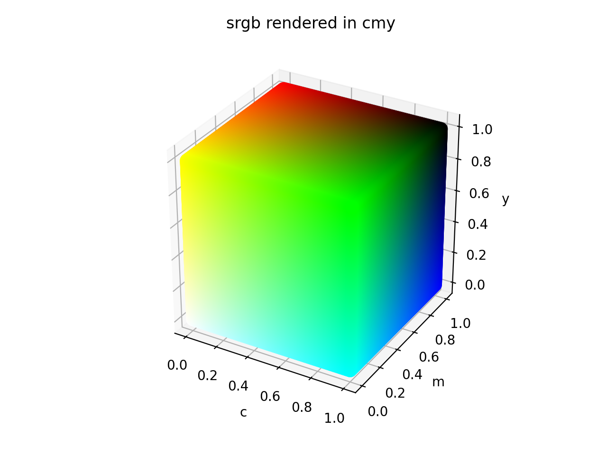
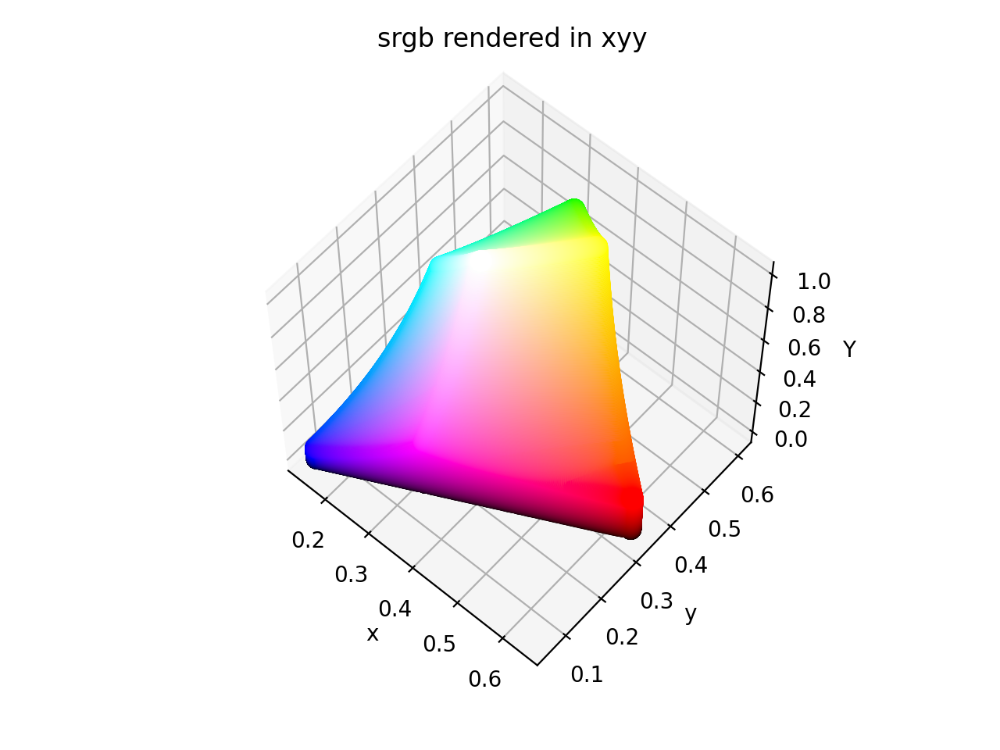
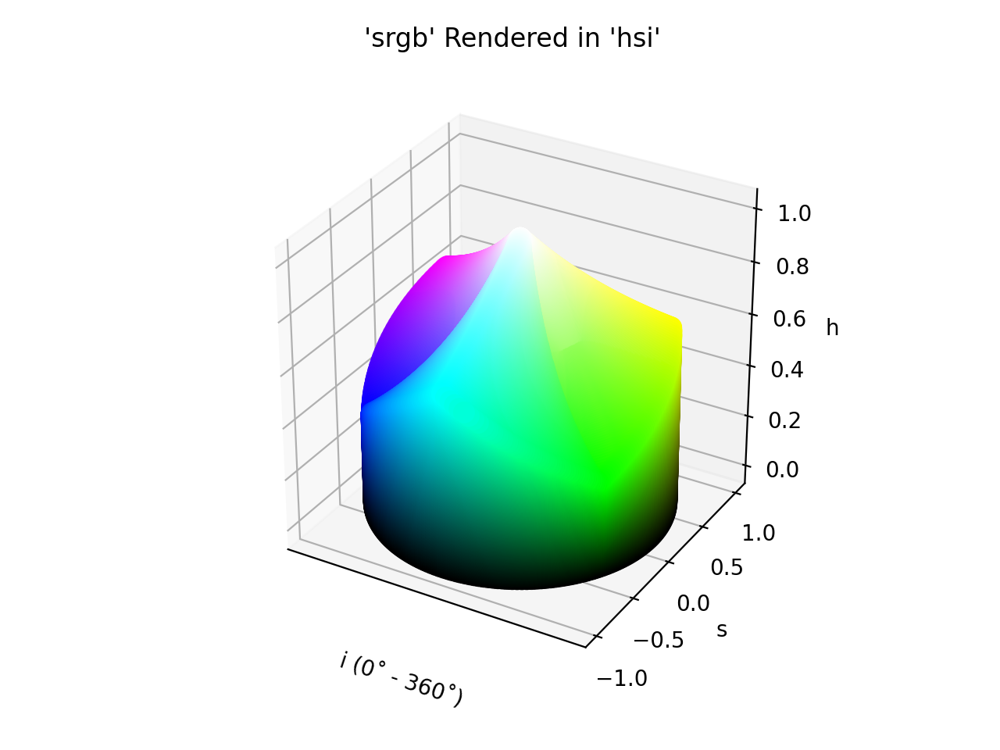
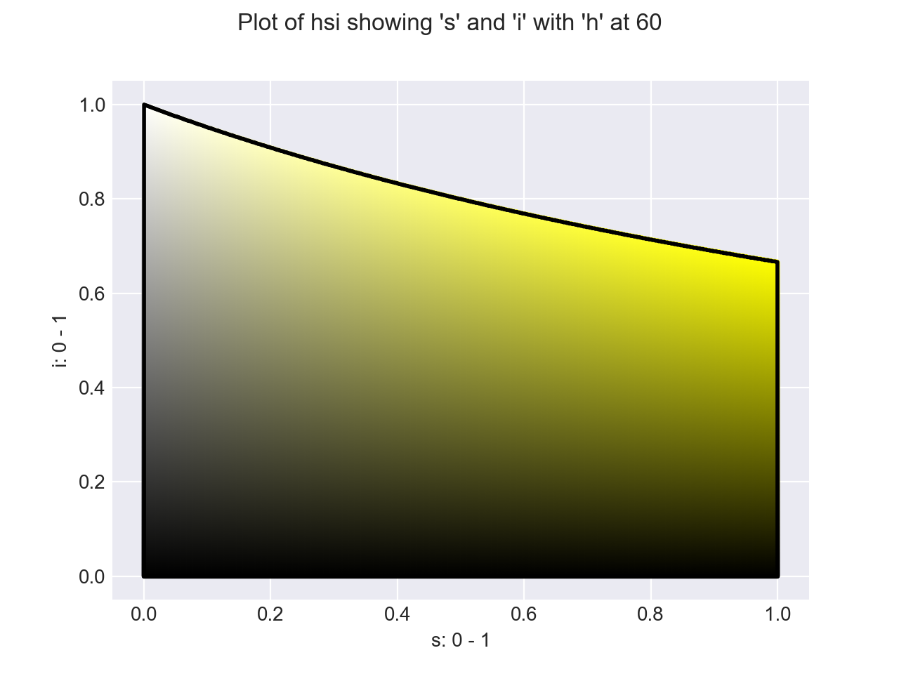
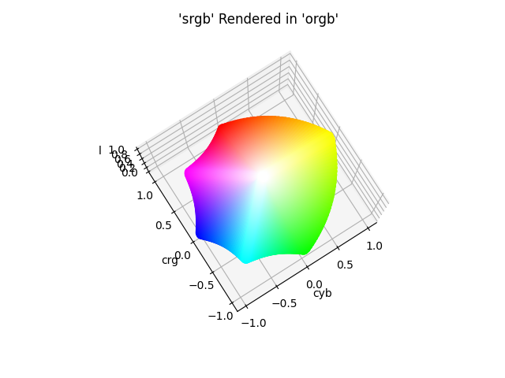
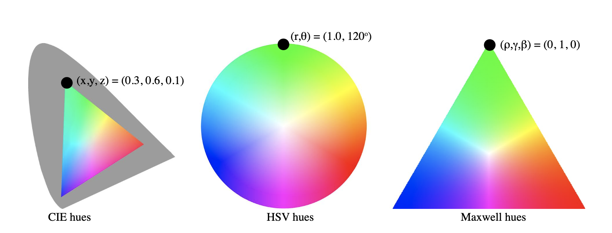
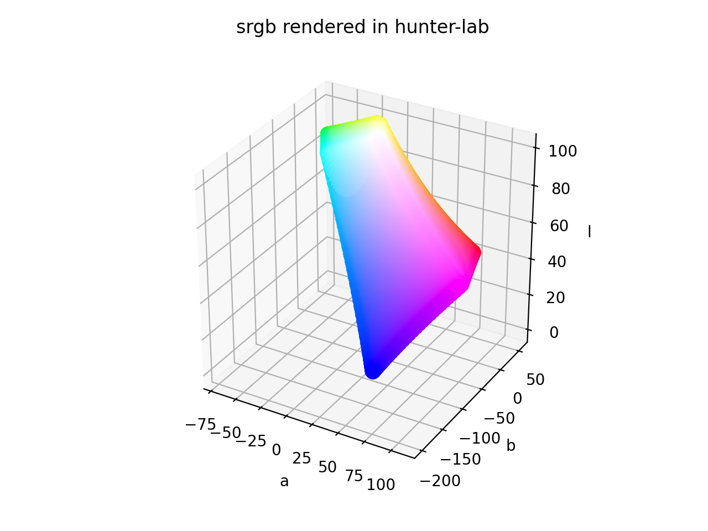
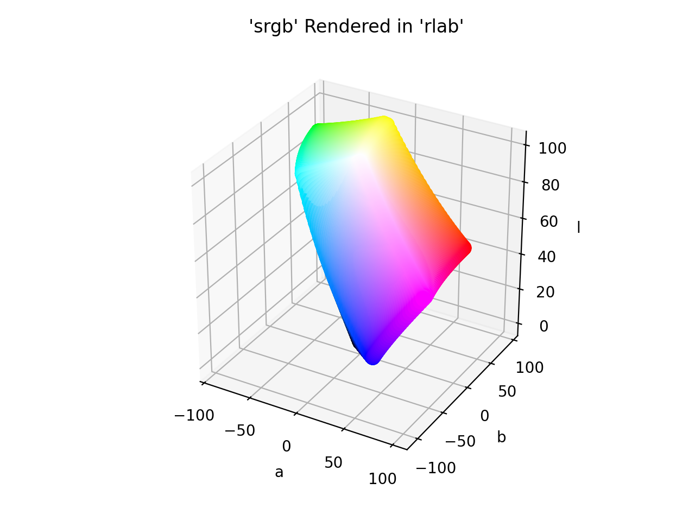
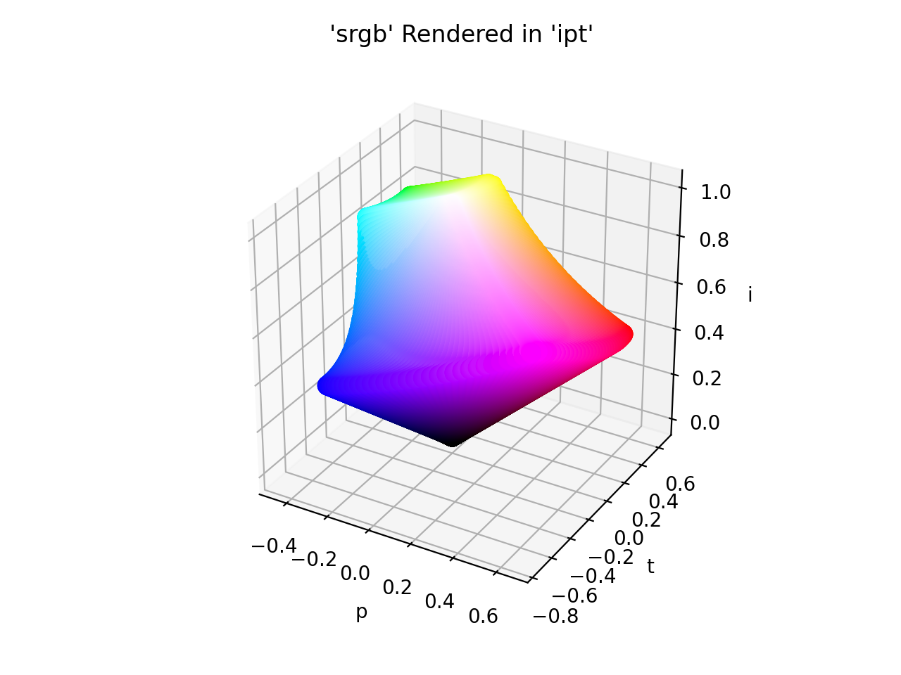
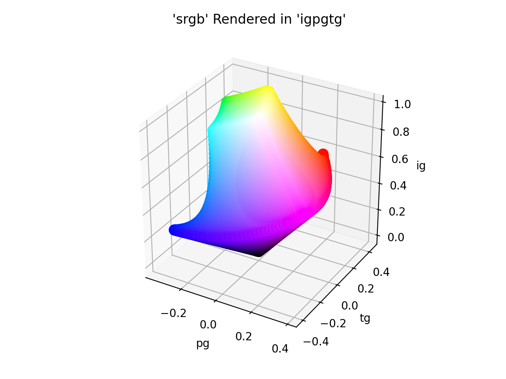

# Supported Color Spaces

ColorAide Extras adds a number of additional color spaces to ColorAide. Some are just spaces that are less practical
to use for common cases, some are just interesting for specific applications, some are implemented just for history,
and some are fairly new and a bit experimental.

## CMY(K)

CMY and CMYK are subtractive color models. The CMY color model itself does not define what is meant by cyan, magenta and
yellow colorimetrically, and so the results of mixing them are not specified as absolute. As far as ColorAide Extra is
concerned, it has defined its primaries the same as sRGB making it an absolute color space.

There are many places in which CMY or CMYK are used, often in device dependent applications. CMYK is used in all sorts
of printing applications, and the exact definition of cyan, magenta, yellow, and black will differ depending on how the
device has implemented it. Unless they are calibrated to the sRGB color space primaries, it is almost certain this will
not match such implementations.

### CMY

<div class="info-container" markdown="1">
!!! info inline end "Properties"

    **Name:** `cmy`

    **White Point:** D65

    **Coordinates:**

    Name | Range
    ---- | -----
    `c`  | [0, 1]
    `m`  | [0, 1]
    `y`  | [0, 1]

<figure markdown="1">



<figcaption>The sRGB gamut represented within the CMY color space.</figcaption>
</figure>

The CMY color model is a subtractive color model in which cyan, magenta and yellow pigments or dyes are added together
in various ways to reproduce a broad array of colors. The name of the model comes from the initials of the three
subtractive primary colors: cyan, magenta, and yellow.

The CMY color space, as ColorAide Extras has chosen to implement it, is directly calculated from the sRGB color space,
and as such, is based off the sRGB primaries.

[Learn more](https://en.wikipedia.org/wiki/CMY_color_model).
</div>

??? abstract "ColorAide Details"

    **Channel Aliases:**
    : 
        Channels | Aliases
        -------- | -------
        `c`      | `cyan`
        `m`      | `magenta`
        `y`      | `yellow`

    **Inputs**
    : 

        CMY is not currently supported in the CSS spec, the parsed input and string output formats use the
        `#!css-color color()` function format using the custom name `#!css-color --cmy`:

        ```css-color
        color(--cmy c m y / a)  // Color function
        ```

    **Output:**
    : 
        The string representation of the color object and the default string output use the
        `#!css-color color(--cmy c m y / a)` form.

        ```playground
        Color("cmy", [0, 0, 0], 1)
        Color("cmy", [0, 0, 0], 1).to_string()
        ```


### CMYK

<div class="info-container" markdown="1">
!!! info inline end "Properties"

    **Name:** `cmyk`

    **White Point:** D65

    **Coordinates:**

    Name | Range
    ---- | -----
    `c`  | [0, 1]
    `m`  | [0, 1]
    `y`  | [0, 1]
    `k`  | [0, 1]

The CMYK color model is a just like [CMY](#cmy) except that it adds an additional channel `k` to control blackness.

The CMYK color space, as ColorAide Extras has chosen to implement it, is directly calculated from the sRGB color space,
and as such, is based off the sRGB primaries.

[Learn more](https://en.wikipedia.org/wiki/CMY_color_model).
</div>

??? abstract "ColorAide Details"

    **Channel Aliases:**
    : 
        Channels | Aliases
        -------- | -------
        `c`      | `cyan`
        `m`      | `magenta`
        `y`      | `yellow`
        `k`      | `black`

    **Inputs**
    : 

        CMY is not currently supported in the CSS spec, the parsed input and string output formats use the
        `#!css-color color()` function format using the custom name `#!css-color --cmyk`:

        ```css-color
        color(--cmyk c m y k / a)  // Color function
        ```

    **Output:**
    : 
        The string representation of the color object and the default string output use the
        `#!css-color color(--cmyk c m y k / a)` form.

        ```playground
        Color("cmyk", [0, 0, 0, 0], 1)
        Color("cmyk", [0, 0, 0, 0], 1).to_string()
        ```

## xyY

<div class="info-container" markdown="1">
!!! info inline end "Properties"

    **Name:** `xyy`

    **White Point:** D65

    **Coordinates:**

    Name | Range
    ---- | -----
    `x`  | [0, 1]
    `y`  | [0, 1]
    `Y`  | [0, 1]

<figure markdown="1">



<figcaption>The sRGB gamut represented within the xyY color space.</figcaption>
</figure>

A derivative of the CIE 1931 XYZ space, the CIE xyY color space, is often used as a way to graphically present the
chromaticity of colors.

[Learn more](https://en.wikipedia.org/wiki/CIE_1931_color_space#CIE_xy_chromaticity_diagram_and_the_CIE_xyY_color_space).
</div>

??? abstract "ColorAide Details"

    **Channel Aliases:**
    : 
        Channels | Aliases
        -------- | -------
        `x`      |
        `y`      |
        `Y`      |

    **Inputs**
    : 

        The xyY space is not currently supported in the CSS spec, the parsed input and string output formats use the
        `#!css-color color()` function format using the custom name `#!css-color --xyy`:

        ```css-color
        color(--xyy x y Y / a)  // Color function
        ```

    **Output:**
    : 
        The string representation of the color object and the default string output use the
        `#!css-color color(--xyy x y Y / a)` form.

        ```playground
        Color("xyy", [0, 0, 0], 1)
        Color("xyy", [0, 0, 0], 1).to_string()
        ```

## CIE 1960 UCS

<div class="info-container" markdown="1">
!!! info inline end "Properties"

    **Name:** `ucs`

    **White Point:** D65

    **Coordinates:**

    Name | Range
    ---- | -----
    `u`  | [0.0, 0.634]^\*^
    `v`  | [0.0, 1.0]^\*^
    `w`  | [0.0, 1.569]^\*^

    ^\*^ ≈ range in relation to sRGB rounded to 3 decimal places.

<figure markdown="1">


<figcaption>The sRGB gamut represented within the CIE 1960 UCS color space.</figcaption>
</figure>

The CIE 1960 color space ("CIE 1960 UCS", variously expanded Uniform Color Space, Uniform Color Scale, Uniform
Chromaticity Scale, Uniform Chromaticity Space) is another name for the (u, v) chromaticity space devised by David
MacAdam. The color space is implemented using the relation between this space and the XYZ space as coordinates U, V, and
W.

[Learn more](https://en.wikipedia.org/wiki/CIE_1960_color_space).
</div>

??? abstract "ColorAide Details"

    **Channel Aliases:**
    : 
        Channels | Aliases
        -------- | -------
        `u`      |
        `v`      |
        `w`      |

    **Inputs**
    : 

        The UCS space is not currently supported in the CSS spec, the parsed input and string output formats use the
        `#!css-color color()` function format using the custom name `#!css-color --ucs`:

        ```css-color
        color(--ucs u v w / a)  // Color function
        ```

    **Output:**
    : 
        The string representation of the color object and the default string output use the
        `#!css-color color(--ucs u v w / a)` form.

        ```playground
        Color("ucs", [0, 0, 0], 1)
        Color("ucs", [0, 0, 0], 1).to_string()
        ```

## CIE 1964 UVW

<div class="info-container" markdown="1">
!!! info inline end "Properties"

    **Name:** `uvw`

    **White Point:** D65

    **Coordinates:**

    Name | Range
    ---- | -----
    `u`  | [-82.154, 171.8]^\*^
    `v`  | [-87.173, 70.825]^\*^
    `w`  | [-17.0, 99.04]^\*^

    ^\*^ ≈ range in relation to sRGB rounded to 3 decimal places.

<figure markdown="1">


<figcaption>The sRGB gamut represented within the UVW color space.</figcaption>
</figure>

!!! note
    It is a bit uncertain as to why the 3D model shows a number of values resolving to a black bulb under the shape,
    but the translation as been compared against some other libraries that have implemented the space, and it seems to
    align :shrug:.

Wyszecki invented the UVW color space in order to be able to calculate color differences without having to hold the
luminance constant. He defined a lightness index W* by simplifying expressions suggested earlier by Ladd and Pinney,
and Glasser et al.. The chromaticity components U* and V* are defined such that the white point maps to the origin,
as in Adams chromatic valence color spaces.

[Learn more](https://en.wikipedia.org/wiki/CIE_1964_color_space).
</div>

??? abstract "ColorAide Details"

    **Channel Aliases:**
    : 
        Channels | Aliases
        -------- | -------
        `u`      |
        `v`      |
        `w`      |

    **Inputs**
    : 

        The UVW space is not currently supported in the CSS spec, the parsed input and string output formats use the
        `#!css-color color()` function format using the custom name `#!css-color --uvw`:

        ```css-color
        color(--uvw u v w / a)  // Color function
        ```

    **Output:**
    : 
        The string representation of the color object and the default string output use the
        `#!css-color color(--uvw u v w / a)` form.

        ```playground
        Color("uvw", [0, 0, 0], 1)
        Color("uvw", [0, 0, 0], 1).to_string()
        ```

## HSI

<div class="info-container" markdown="1">
!!! info inline end "Properties"

    **Name:** `hsi`

    **White Point:** D65

    **Coordinates:**

    Name | Range
    ---- | -----
    `h`  | [0, 360)
    `s`  | [0, 1]
    `i`  | [0, 1]

<figure markdown="1">



<figcaption>The sRGB gamut represented within the HSI color space.</figcaption>
</figure>

The HSI model is similar to models like HSL and HSV except that it uses I for intensity instead of Lightness or Value.
It does not attempt to "fill" a cylinder by its definition of saturation leading to a very different look when we plot
it.



[Learn more](https://en.wikipedia.org/wiki/HSL_and_HSV#HSI_to_RGB).
</div>

??? abstract "ColorAide Details"

    **Channel Aliases:**
    : 
        Channels | Aliases
        -------- | -------
        `h`      | `hue`
        `s`      | `saturation`
        `i`      | `intensity`

    **Inputs**
    : 

        The HSI space is not currently supported in the CSS spec, the parsed input and string output formats use the
        `#!css-color color()` function format using the custom name `#!css-color --hsi`:

        ```css-color
        color(--hsi h s i / a)  // Color function
        ```

    **Output:**
    : 
        The string representation of the color object and the default string output use the
        `#!css-color color(--hsi h s i / a)` form.

        ```playground
        Color("hsi", [0, 0, 0], 1)
        Color("hsi", [0, 0, 0], 1).to_string()
        ```

## oRGB

<div class="info-container" markdown="1">
!!! info inline end "Properties"

    **Name:** `orgb`

    **White Point:** D65

    **Coordinates:**

    Name  | Range
    ----- | -----
    `l`   | [0, 1]
    `cyb` | [-1, 1]
    `crg` | [-1, 1]

<figure markdown="1">



<figcaption>The sRGB gamut represented within the oRGB color space.</figcaption>
</figure>

A new color model that is based on opponent color theory. Like HSV, it is designed specifically for computer graphics.
However, it is also designed to work well for computational applications such as color transfer, where HSV falters.
Despite being geared towards computation, oRGB’s natural axes facilitate HSV-style color selection and manipulation.
oRGB also allows for new applications such as a quantitative cool-to-warm metric, intuitive color manipulations and
variations, and simple gamut mapping. This new color model strikes a balance between simplicity and the computational
qualities of color spaces such as CIELAB.

[Learn more](https://graphics.stanford.edu/~boulos/papers/orgb_sig.pdf).
</div>

??? abstract "ColorAide Details"

    **Channel Aliases:**
    : 
        Channels | Aliases
        -------- | -------
        `l`      | `luma`
        `cyb`    |
        `crb`    |

    **Inputs**
    : 

        The oRGB space is not currently supported in the CSS spec, the parsed input and string output formats use the
        `#!css-color color()` function format using the custom name `#!css-color --orgb`:

        ```css-color
        color(--orgb l cyb crb / a)  // Color function
        ```

    **Output:**
    : 
        The string representation of the color object and the default string output use the
        `#!css-color color(--orgb l cyb crg / a)` form.

        ```playground
        Color("orgb", [0, 0, 0], 1)
        Color("orgb", [0, 0, 0], 1).to_string()
        ```

## Prismatic

<div class="info-container" markdown="1">
!!! info inline end "Properties"

    **Name:** `prismatic`

    **White Point:** D65

    **Coordinates:**

    Name | Range
    ---- | -----
    `l`  | [0, 1]
    `r`  | [0, 1]
    `g`  | [0, 1]
    `b`  | [0, 1]

<figure markdown="1">



<figcaption>The sRGB gamut represented within the Prismatic color space.</figcaption>
</figure>

The Prismatic model introduces a simple transform of the RGB color cube into a light/dark dimension and a 2D hue. The
hue is a normalized (barycentric)triangle with pure red, green, and blue at the vertices, often called the Maxwell Color
Triangle.  Each cross section of the space is the same barycentric triangle, and the light/dark dimension runs zero to
one for each hue so the whole color volume takes the form of a prism.

[Learn more](http://psgraphics.blogspot.com/2015/10/prismatic-color-model.html).
</div>

??? abstract "ColorAide Details"

    **Channel Aliases:**
    : 
        Channels | Aliases
        -------- | -------
        `l`      | `lightness`
        `r`      | `red`
        `g`      | `green`
        `b`      | `blue`

    **Inputs**
    : 

        The Prismatic space is not currently supported in the CSS spec, the parsed input and string output formats use
        the `#!css-color color()` function format using the custom name `#!css-color --prismatic`:

        ```css-color
        color(--prismatic l r g b / a)  // Color function
        ```

    **Output:**
    : 
        The string representation of the color object and the default string output use the
        `#!css-color color(--prismatic l r g b / a)` form.

        ```playground
        Color("prismatic", [0, 0, 0, 0], 1)
        Color("prismatic", [0, 0, 0, 0], 1).to_string()
        ```

## Hunter Lab

<div class="info-container" markdown="1">
!!! info inline end "Properties"

    **Name:** `hunter-lab`

    **White Point:** D65

    **Coordinates:**

    Name | Range
    ---- | -----
    `l`  | [0.0, 100.0]^\*^
    `a`  | [-69.078, 109.459]^\*^
    `b`  | [-199.782, 55.728]^\*^

    ^\*^ ≈ range in relation to sRGB rounded to 3 decimal places.

<figure markdown="1">



<figcaption>The sRGB gamut represented within the Hunter Lab color space.</figcaption>
</figure>

The Hunter Lab color space, defined in 1948 by Richard S. Hunter, is another color space referred to as "Lab". Like
CIELAB, it was also designed to be computed via simple formulas from the CIEXYZ space, but to be more perceptually
uniform than CIEXYZ. Hunter named his coordinates L, a, and b. The CIE named the coordinates for CIELAB as L*, a*, b* to
distinguish them from Hunter's coordinates.

[Learn more](https://support.hunterlab.com/hc/en-us/articles/203997095-Hunter-Lab-Color-Scale-an08-96a2).
</div>

??? abstract "ColorAide Details"

    **Channel Aliases:**
    : 
        Channels | Aliases
        -------- | -------
        `l`      | `lightness`
        `a`      |
        `b`      |

    **Inputs**
    : 

        The Hunter Lab space is not currently supported in the CSS spec, the parsed input and string output formats use
        the `#!css-color color()` function format using the custom name `#!css-color --hunter-lab`:

        ```css-color
        color(--hunter-lab l a b / a)  // Color function
        ```

    **Output:**
    : 
        The string representation of the color object and the default string output use the
        `#!css-color color(--hunter-lab l a b / a)` form.

        ```playground
        Color("hunter-lab", [0, 0, 0], 1)
        Color("hunter-lab", [0, 0, 0], 1).to_string()
        ```

## RLAB

<div class="info-container" markdown="1">
!!! info inline end "Properties"

    **Name:** `rlab`

    **White Point:** D65

    **Coordinates:**

    Name | Range
    ---- | -----
    `l`  | [0.0, 100.0]^\*^
    `a`  | [-90.566, 101.151]^\*^
    `b`  | [-106.018, 95.194]^\*^

    ^\*^ ≈ range in relation to sRGB rounded to 3 decimal places.

<figure markdown="1">



<figcaption>The sRGB gamut represented within the RLAB color space.</figcaption>
</figure>

The RLAB color-appearance space was developed by Fairchild and Berns for cross-media color reproduction applications in
which images are reproduced with differing white points, luminance levels, and/or surrounds.

[Learn more](https://scholarworks.rit.edu/cgi/viewcontent.cgi?article=1153&context=article).
</div>

??? abstract "ColorAide Details"

    **Channel Aliases:**
    : 
        Channels | Aliases
        -------- | -------
        `l`      | `lightness`
        `a`      |
        `b`      |

    **Inputs**
    : 

        The RLAB space is not currently supported in the CSS spec, the parsed input and string output formats use the
        `#!css-color color()` function format using the custom name `#!css-color --rlab`:

        ```css-color
        color(--rlab l a b / a)  // Color function
        ```

    **Output:**
    : 
        The string representation of the color object and the default string output use the
        `#!css-color color(--rlab l a b / a)` form.

        ```playground
        Color("rlab", [0, 0, 0], 1)
        Color("rlab", [0, 0, 0], 1).to_string()
        ```

## IPT

<div class="info-container" markdown="1">
!!! info inline end "Properties"

    **Name:** `ipt`

    **White Point:** D65

    **Coordinates:**

    Name | Range
    ---- | -----
    `i`  | [0.0, 1.0]^\*^
    `p`  | [-0.453, 0.662]^\*^
    `t`  | [-0.748, 0.651]^\*^

    ^\*^ ≈ range in relation to sRGB rounded to 3 decimal places.

<figure markdown="1">



<figcaption>The sRGB gamut represented within the IPT color space.</figcaption>
</figure>

Ebner and Fairchild addressed the issue of non-constant lines of hue in their color space dubbed IPT. The IPT color
space converts D65-adapted XYZ data (XD65, YD65, ZD65) to long-medium-short cone response data (LMS) using an adapted
form of the Hunt-Pointer-Estevez matrix (MHPE(D65)).

The IPT color appearance model excels at providing a formulation for hue where a constant hue value equals a constant
perceived hue independent of the values of lightness and chroma (which is the general ideal for any color appearance
model, but hard to achieve). It is therefore well-suited for gamut mapping implementations.

[Learn more](https://www.researchgate.net/publication/21677980_Development_and_Testing_of_a_Color_Space_IPT_with_Improved_Hue_Uniformity.).
</div>

??? abstract "ColorAide Details"

    **Channel Aliases:**
    : 
        Channels | Aliases
        -------- | -------
        `i`      |
        `p`      |
        `t`      |

    **Inputs**
    : 

        The IPT space is not currently supported in the CSS spec, the parsed input and string output formats use the
        `#!css-color color()` function format using the custom name `#!css-color --ipt`:

        ```css-color
        color(--ipt i p t / a)  // Color function
        ```

    **Output:**
    : 
        The string representation of the color object and the default string output use the
        `#!css-color color(--ipt i p t / a)` form.

        ```playground
        Color("ipt", [0, 0, 0], 1)
        Color("ipt", [0, 0, 0], 1).to_string()
        ```

## IgPgTg

<div class="info-container" markdown="1">
!!! info inline end "Properties"

    **Name:** `ipt`

    **White Point:** D65

    **Coordinates:**

    Name | Range
    ---- | -----
    `ig` | [0.0, 0.974]^\*^
    `pg` | [-0.354, 0.394]^\*^
    `tg` | [-0.412, 0.437]^\*^

    ^\*^ ≈ range in relation to sRGB rounded to 3 decimal places.

<figure markdown="1">



<figcaption>The sRGB gamut represented within the IgPgTg color space.</figcaption>
</figure>

IgPgTg uses the same structure as IPT, an established hue-uniform color space utilized in gamut mapping applications.
While IPT was fit to visual data on the perceived hue, IGPGTG was optimized based on evidence linking the peak
wavelength of Gaussian-shaped light spectra to their perceived hues.

[Learn more](https://www.researchgate.net/publication/21677980_Development_and_Testing_of_a_Color_Space_IPT_with_Improved_Hue_Uniformity.).
</div>

??? abstract "ColorAide Details"

    **Channel Aliases:**
    : 
        Channels | Aliases
        -------- | -------
        `ig`     |
        `pg`     |
        `tg`     |

    **Inputs**
    : 

        The IgPgTg space is not currently supported in the CSS spec, the parsed input and string output formats use the
        `#!css-color color()` function format using the custom name `#!css-color --igpgtg`:

        ```css-color
        color(--igpgtg ig pg tg / a)  // Color function
        ```

    **Output:**
    : 
        The string representation of the color object and the default string output use the
        `#!css-color color(--igpgtg ig pg tg / a)` form.

        ```playground
        Color("igpgtg", [0, 0, 0], 1)
        Color("igpgtg", [0, 0, 0], 1).to_string()
        ```

<style>
.info-container {display: inline-block;}
</style>
