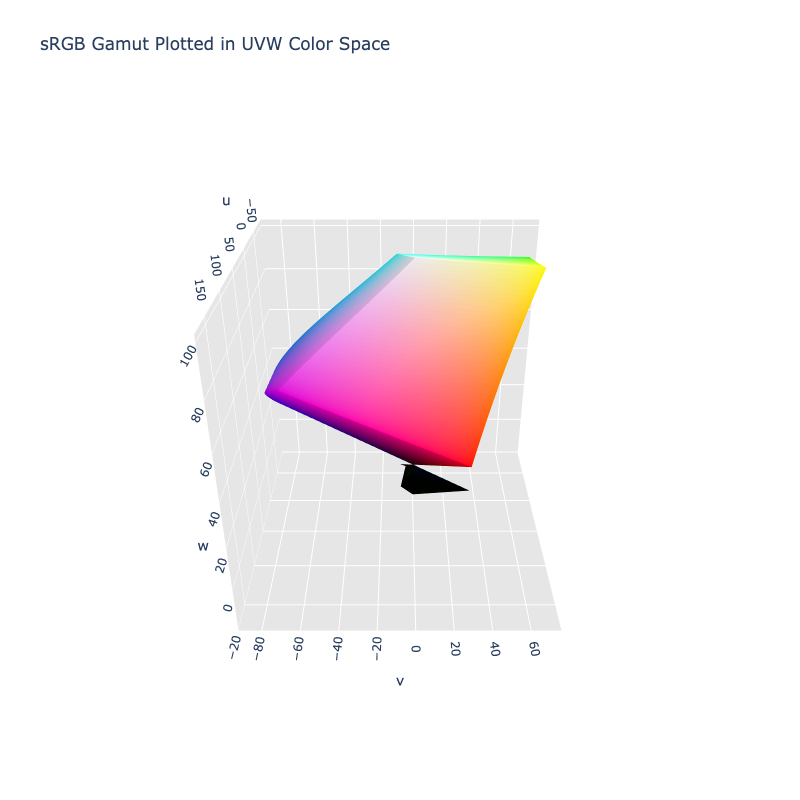

# CIE 1964 UVW

/// html | div.info-container
//// info | Properties
    attrs: {class: inline end}

**Name:** `uvw`

**White Point:** D65

**Coordinates:**

Name | Range^\*^
---- | -----
`u`  | [-100.0, 100.0]
`v`  | [-100.0, 100.0]
`w`  | [0.0, 100.0]

^\*^ Range is currently quite arbitrary.
////



//// figure-caption
The sRGB gamut represented within the UVW color space.
////

//// note
It is a bit uncertain as to why the 3D model shows a number of values resolving to a black bulb under the shape,
but the translation as been compared against some other libraries that have implemented the space, and it seems to
align :shrug:.
////

Wyszecki invented the UVW color space in order to be able to calculate color differences without having to hold the
luminance constant. He defined a lightness index W* by simplifying expressions suggested earlier by Ladd and Pinney,
and Glasser et al.. The chromaticity components U* and V* are defined such that the white point maps to the origin,
as in Adams chromatic valence color spaces.

[Learn more](https://en.wikipedia.org/wiki/CIE_1964_color_space).
///

## Channel Aliases

Channels | Aliases
-------- | -------
`u`      |
`v`      |
`w`      |

## Input/Output

The UVW space is not currently supported in the CSS spec, the parsed input and string output formats use the
`#!css-color color()` function format using the custom name `#!css-color --uvw`:

```css-color
color(--uvw u v w / a)  // Color function
```

The string representation of the color object and the default string output use the
`#!css-color color(--uvw u v w / a)` form.

```py play
Color("uvw", [171.8, 24.715, 52.261])
Color("uvw", [73.871, 48.705, 73.965]).to_string()
```

## Registering

```py
from coloraide import Color as Base
from coloraide_extras.spaces.uvw import UVW

class Color(Base): ...

Color.register(UVW())
```
