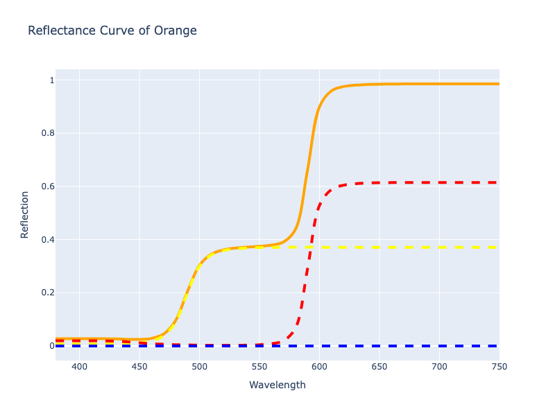
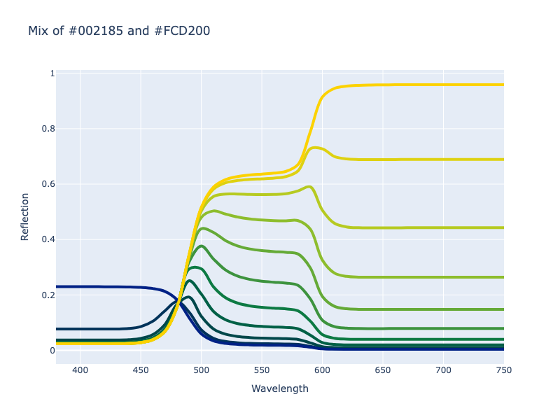

# Spectral Interpolation

## Description

Light, on its own, doesn't mix like pigments due to the way pigments absorb and scatter light. [Kubelka-Munk theory](
https://en.wikipedia.org/wiki/Kubelka%E2%80%93Munk_theory) is a fundamental approach to modelling the appearance of
paint films and predicting this absorption and scattering. Utilizing Kubelka-Munk theory, colors can be simulated to
mix more like paints.

```py play
red = Color('rgb(128, 2, 46)').mix('white', 0.25, method='spectral')
yellow = Color('rgb(252, 211, 0)').mix('white', 0.25, method='spectral')
blue = Color('rgb(13, 27, 68)').mix('white', 0.25, method='spectral')
Wheel(Color.steps([red, yellow, blue, red], steps=13, method='spectral', out_space='srgb')[:-1])
Steps(Color.steps([red, yellow, blue, red], steps=13, method='spectral', out_space='srgb')[:-1])
```

The "spectral" interpolation method is based on Kubelka-Munk theory and, more specifically, follows after the approach
implemented in the [Spectral.js](https://github.com/rvanwijnen/spectral.js) project. Spectral.js approximates paint
mixing by using spectral data to generate reflectance curves and uses them to mix colors by applying Kubelka-Munk theory.
This approach is also based off the work that was done during the development of another project, [Mixbox](
https://github.com/scrtwpns/mixbox). More specifically, it is based on the [paper that the Mixbox folks published](
https://scrtwpns.com/mixbox.pdf).


While Mixbox uses real paint data and tries to model these paints as close as it can, the "spectral" approach tries more
to capture the feel of mixing paints without specifically basing it off real paint data.

/// tab | Spectral Mix

```py play
c1 = Color('#002185')
c2 = Color('#FCD200')
Color.interpolate([c1, c2], method='spectral')
Steps(Color.steps([c1, c2], method='spectral', steps=9))
```
///

/// tab | RGB Mix
```py play
c1 = Color('#002185')
c2 = Color('#FCD200')
Color.interpolate([c1, c2], space='srgb')
Steps(Color.steps([c1, c2], space='srgb', steps=9))
```
///

## How It Works

The idea is simple enough. Create a palette of primary colors from which you can mix and get all the colors within your
desired gamut, which in our case is sRGB. Once the colors are selected, reflectance curves need to be generated for
those primary colors. There are various ways in which such curves could be created, but the chosen approach that was
settled on involves applying applying the [research of Scott Burns](http://scottburns.us/reflectance-curves-from-srgb-10/).
His research details a way to use spectral data to approximate reflectance curves for any color within the sRGB gamut.

With our primary colors selected and the reflectance curves created for each one, we can use these curves to create any
color within our gamut. More interestingly, we can take a color and deconstruct it into concentrations of these primary
reflectance curves and then construct a new curve that represents the color.


/// figure-caption
Orange decomposed into cyan, magenta, yellow, red, green, and blue reflectance curves and then reconstructed into its
own curve.
///

With the ability to represent almost any color within our gamut as a reflectance curve, we then can mix colors by
identifying what the curves are and then applying Kubelka-Munk theory, converting those curves into absorption and
scattering data and mixing them. Once mixed, we can transform them back to a reflectance curve and then back to our
target color space.


/// figure-caption
Mixing a blue and yellow color with Kubelka-Munk theory.
///

Kubelka-Munk theory can be used in a couple of ways, one that utilizes absorption and scattering data independent of
each other, which can be referred to as the two-constant approach, and one that treats the absorption and scattering
as a single constant, which we will call the single-constant approach. Generally, for paint, the two-constant approach
is probably more accurate, but since we generate the reflectance curves without knowing specifically what the absorption
vs scattering properties are, especially since this is not based off real paint data, the "spectral" mixing uses the
single-constant approach.

Lastly, because the single-constant approach we are using produces colors a bit more darkly, Spectral.js applies an
easing function to the interpolation progress that favors the more dominant luminance when mixing, biasing the color
more towards the color with more intense luminance. This is applied to give a more aesthetically pleasing mix that
appears more like what you wound have when using something like Mixbox.

## Differences

It should be noted that we do deviate a bit from the Spectral.js implementation. As we explored this approach we found
a few things that we found to be unnecessary, things we could improve upon, or just things we approached slightly
different.

1.  Following the approach outlined by Scott Burns, we regenerated all the data at higher precision and ensured that it
    was done with the same transformation matrices and white points that we use within our library. This was done just
    to ensure we have more precise transforms within our library.

2.  Spectral.js uses primary colors of:

    - `#!color rgb(255 255 255)`
    - `#!color rgb(255 0 0)`
    - `#!color rgb(0 255 0)`
    - `#!color rgb(0 0 255)`
    - `#!color rgb(0 255 255)`
    - `#!color rgb(255 0 255)`
    - `#!color rgb(255 255 0)`

    During our evaluation, we found that including `#!color rgb(255 255 255)` provided no significant improvements as
    the other primary colors provide sufficient coverage with comparable results.

3.  During decomposition of colors, we constrain concentrations to be between 0 and 1. We also constrain the final
    composite reflectance curve to be between a very small value and 1 as the Kubelka-Munk functions expect reflectance
    to not be zero and not exceed 1. We compensate for this by calculating the residual (the difference between the
    expected XYZ value and the recreated XYZ value) and mixing it separately and then adding the results back into the
    final result. This allows us to reasonably represent colors that may exceed the actual gamut that the primary
    reflectance curves can actually reproduce and even colors that exceed the sRGB gamut entirely, though colors within
    the sRGB gamut should be considered to have more accurate Kubelka-Munk mixing.

    Our approach differs from Spectral.js which does not clamp the high end values and does not utilize residuals which
    causes inaccuracies in round tripping of colors through the Kubelka-Munk functions if the color's reflectance curve
    has values that exceed 1. Better stated, the Spectral.js approach can process most of the colors in the sRGB gamut
    accurately, but not all. It should be noted though that Spectral.js clamps their final results to the course
    resolution of sRGB hexadecimal values, and because of they are limited to the sRGB gamut only, and to such a low
    resolution, inaccuracies are not easily observable. Since we allow for the expectation of great precision and larger
    gamuts, we cannot get away with the same approach and require some mitigation.

4.  Spectral.js generally clips the mixed colors to sRGB hexadecimal resolution before returning them. We do not clip
    any colors that are out-of-gamut due to mixing in case the user is within a gamut that can accommodate them. We
    also do not force hexadecimal resolution. We let the user chose how they will gamut map their colors and to what
    resolution they wish to round the their values to. This means we allow colors that exceed the sRGB gamut if that is
    desired. In short, users are free to clip the returned colors or gamut map them in any way they see fit.

    ```py play
    c1 = Color('color(display-p3 0 0 1)')
    c2 = Color('color(display-p3 1 1 0)')
    Color.interpolate([c1, c2], method='spectral')
    Steps(Color.steps([c1, c2], method='spectral', steps=9))
    ```

5.  Lastly, Spectral.js has the concept of "tinting strength". It is essentially parameter to manually adjust the
    weight of a color when mixing. It is a fiddly way to subjectively adjust the interpolation between individual
    colors. We do not implement this and all interpolations essentially perform as if the "tinting strength" is set to 1
    which causes this variable to drop out.

## Registering

Spectral mixing comes in two flavors, one which operations in normal piecewise linear, the other which uses the
["continuous"](https://facelessuser.github.io/coloraide/interpolation/#continuous-interpolation) approach when handling
undefined channels.

```py
from coloraide import Color as Base
from coloraide_extras.interpolate.spectral import Spectral, SpectralContinuous

class Color(Base): ...

Color.register(Spectral())
Color.register(SpectralContinuous())
```